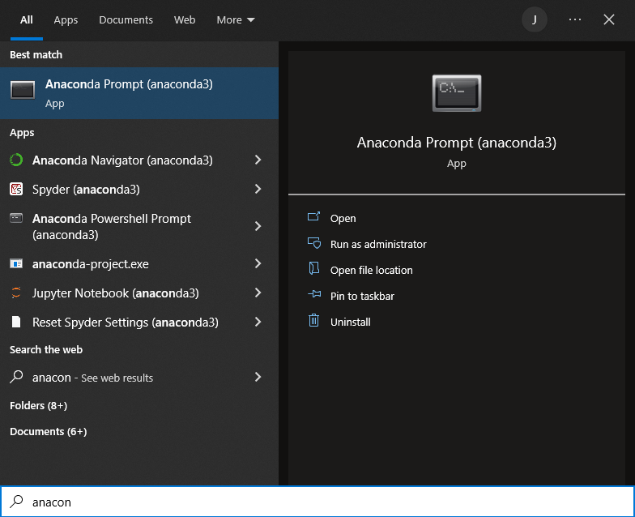

# Automating understand.ai Anonymizer Documentation
### Python: 3.6.8 64-bit
### Windows 10: Digital Kitchener/Remote work laptops *Not tested on Unix systems*
### Environments:
- Anaconda3 -> py368
- Virtual Environment -> anonymizer

## Anonymize.zip folder setup ***To be extracted in C:\Users\Remote***
### Contents
anonymizer
----- program files to be executed within the virtual environments
* ensure input folder under C:\Users\Remote\anonymizer contains images you wish to anonymize

~/.virtualenvs
----- virtual environment setup (libraries, imports, packages, etc.)

setup
----- Anonymize-setup.bat  ->  For first time setup and anonymizing images
* runs anonymize_app_setup.py, setup.sh

----- Anonymize.bat        ->  For anonymizing images 
* runs run_anonymizer.py, run.sh

[Anaconda3.exe](https://repo.anaconda.com/archive/Anaconda3-2022.05-Windows-x86_64.exe)
----- create folder in C:\Users\Remote, create conda environment using Anaconca prompt terminal

[Git-2.36.1.exe](https://github.com/git-for-windows/git/releases/download/v2.36.1.windows.1/Git-2.36.1-64-bit.exe)
----- allow default setup in C:\Program Files

[python-3.6.8-64.exe](https://www.python.org/ftp/python/3.6.8/python-3.6.8-amd64.exe)
----- download and run only this version of python on your computer


----
## To Run
Ensure that ~ and anaconda3 folders are in C:\Users\Remote

Once all is installed (Anaconda3, Git), open *Anaconda prompt* and create your conda environment

```create conda --name py368 python=3.6.8```
-  when prompted to proceed, say yes: (y/n)?: y



In the setup folder, double click on
* **Anonymize-setup.bat** for first-time running only
* **Anonymize.bat** to run thereafter
#### Run **Anonymize.bat** for other uses once setup is complete

Having applications like Teams and Chrome open in the background impacts the processing time. Of the application times out before anonymizing all images in the input folder, having the input folder open in File Explorer fixes this

Two terminal windows will appear once run. The git-bash window prints anonymization status and closes itself once finished

*Shortcuts to the input and outut folders to a desired location allow for user ease of use. Default setup has been written for setup folder to reside in C:\Users\Remote\Desktop - modified to C:\Users\Remote for end user*


----
## Notes & Important Findings
-If setup does not run, opening command prompt and manually pip installing requirements from requirements.txt is sufficient

-Tensorflow only should be pip installed once, if done more than once, the program may respond with:
*   ModuleNotFound errors - anonymizer/detector/obfuscation module/package not found, tensorflow does not recognize *import tensorflow as ts*
*   Errors fixed once tensorflow is first pip uninstalled and then associated tensorflow folders are manually deleted in .virtualenvs site-packages folder
- ```pip uninstall tensorflow```
- C:/Users/Remote/.virtualenvs/anonymizer/Lib/site-packages, tensorboard to tensorflow-1.13.1.dist-info
* ```pip install tensorflow==1.13.1``` once all previous instaces of tensorflow are removed

-Strengthen or weaken blur via run.sh and setup.sh's *--obfuscation-kernel* param. README in anonymizer folder has details on what each number represents

-Input and output folders are changed?
*   Ensure input and output folders are in their default destinations, with shortcuts created in user's desired folder 
